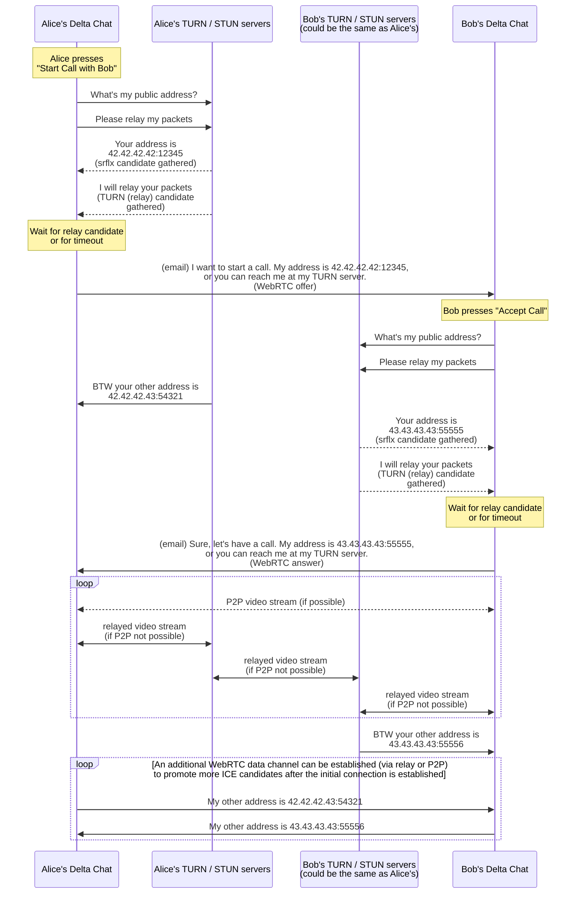

# Call

P2P videocalls via WebRTC for integration into Delta Chat clients.

## How it works

Below is a sequence diagram of how Delta Chat works together with this app.
If you see a block of text instead of a diagram, go
[here](https://mermaid.ink/svg/pako:eNqtVstu2zAQ_JUFL7UBx43ltxCkiJ0ecmgQJA6MFr7Q0tomSokqSSV1g_x7l5QUO34UaVpDB0ncndmdHVJ-YpGKkYXM4I8c0wgvBV9qnsxSoF_GtRWRyHhq4UKKCIGb4uaDgUuUlsN4xe2B4Mn97fV2sH_-CHeT-2swqB9Qm_2sUZU1UvPDOWdzfQ61SOUyhjmCXSEYnmyXVT8Aq-Yb0O2qi9BrZREUoRcQYdlpptEY9IwzdmcJD8ZcSngUduWwZqxIL6JPzs-LpkOYEjYRJWvI8jktAo9jh_XpSPyNRG4QNEq-9lk8-o62lKcQ8sSHF9V9VbmuIEH4-jpBs7rCVtDudN3LmtEL-RMinsYi5tTikpNcGuP6MeQr6o0aLApZO5qyFA_nw2t-sb5BdUs7wHt6TrmwsFC6RH6VS2_dihUJqtzuKkQyh1DDhAtZd-W5aVoFxk-DE5KUTfiy3pID9rRolDTUkKOmIni0AucZ69T2bRXuavo-pzi_nYxBLRao6_se8SU5R5X-gBm7iCLMCndUpnABvoE3WWIn-i2G2ExtNJkWw1JuCked0Q67nXbQKgk3s_f9HPJUu1ldYdf93uKpXdz_7iiP-rd-quQtBav8dJdrbIBEN5kVf8BjhtoV4p2G4ql53HKUVCor7jaWPzvbSHcT3MCDiNG5nRgSqIkFZMoYMZdYP5C5OVC8LBi_SveVEIKDTZU9iOQrL5BG_4Q02kZyzbwDB9O4kmr0Yvli8_3R8DvT6m3rDRepCxdWqJRLKAdD1qHJr3iaovQDpQ8L0hFDG9WsqOjag-Cl1WjqWZDVHREdQ5lWiXNmojTC1fjzxokG-MJSbe77JFLiI7ZIEUHkqJ2rtgh2Z_nSKPlwt0U4sqEP2Pxg9r46pdaswZZaxCy0OscGS1DTJqFH9uRCZoyQEpyxkG5jXPBcWnfUPVMafWK_KZVUmVrlyxULF1waesozJ0f5n-LlrSZC1GOVp5aFrdbAg7Dwif1kYdBu9vrdoNNvDYP2IBi0ggZbs_Ck1eq3m8Ne93TQHwxPe0H3ucF-eV7Soke9tPuD_vA0GFDA82_Bo8ZW).



## Integrating

To integrate into your Delta Chat client you need to provide a
`window.calls` object with the following API:

- `startCall: (offerPayload: string) => void` (implementation must call `dc_place_outgoing_call` chatmail core API)
- `acceptCall: (answerPayload: string) => void` (implementation must call `dc_accept_incoming_call` chatmail core API)
- `endCall: () => void` (implementation must call `dc_end_call` chatmail core API)
- `getIceServers: () => string | Promise<string>` (returns a JSON string with array of ice server configurations as expected by https://developer.mozilla.org/en-US/docs/Web/API/RTCPeerConnection/setConfiguration)
- `getAvatar: () => string` (returning the chat's avatar image URL; can be a regular URL or a data-URL, ex. `"data:image/png;base64,..."`)

Commands are given to the app via URL hash:

- `#startCall`: tells the app to generate an offer payload and call `startCall()`, this is how the app should be open when the user is starting an outgoing call.
- `#offerIncomingCall=PAYLOAD`: tells the app to show the "Incoming call. Answer?" screen. Then, if the user clicks "Answer", generate a WebRTC answer to the offer provided in `PAYLOAD`, and call `window.calls.acceptCall(webrtcAnswer)`. If the user declined the call, the app will invoke `window.calls.endCall`.
- `#acceptCall=PAYLOAD`: same as `#offerIncomingCall`, but doesn't show the "Incoming call. Answer?" screen and instead automatically and immediately accepts the call.
- `#onAnswer=PAYLOAD`: notifies the app that the outgoing call was accepted and provides the answer payload

**IMPORTANT:** `PAYLOAD` **must** be base64 encoded (NOTE: you might still need to URL-encode the base64 string to be a valid URL hash) before passing it to the app in the URL hash.

In order to start the app in audio-only mode initially,
provide `noOutgoingVideoInitially` in the query (search) string
of the initial URL, e.g. `/index.html?noOutgoingVideoInitially#startCall`.

In order to completely disable incoming and outgoing video,
provide `disableVideoCompletely` in the query string of the URL.
See <https://github.com/deltachat/calls-webapp/issues/31>.

## Contributing

### Installing Dependencies

After cloning this repo, install dependencies:

```
pnpm i
```

### Checking code format

```
pnpm check
```

### Testing the app in the browser

To test your work in your browser while developing:

```
pnpm start
```

Open the simulated instances in 2 separate tabs (the "share" button on the instance in the simulator).
Then add `#startCall` to the end of the URL of one instance.

On macOS on Safari, you may not be able to give access to the camera to two tabs simultaneously; in this case, try Firefox.

### Building

To build the app for releasing:

```
pnpm build
```

To package the app with developer tools inside to debug in Delta Chat, set the `NODE_ENV`
environment variable to "debug":

```
NODE_ENV=debug pnpm build
```

The resulting optimized `.html` file is saved in `dist/` folder.

### Releasing

To automatically build and create a new GitHub release with the `.html` file:

```
git tag -a v1.0.1
git push origin v1.0.1
```

### Credits

Inspired by [Serverless WebRTC][serverless-webrtc] but built from scratch and much simpler:
no data channel, file transfer and only browsers are supported.

See blog posts explaining the idea here:

- [WebRTC without a signaling server](https://blog.printf.net/articles/2013/05/17/webrtc-without-a-signaling-server/)
- [Serverless WebRTC, continued](https://blog.printf.net/articles/2014/07/01/serverless-webrtc-continued/)

[serverless-webrtc]: https://github.com/cjb/serverless-webrtc/
